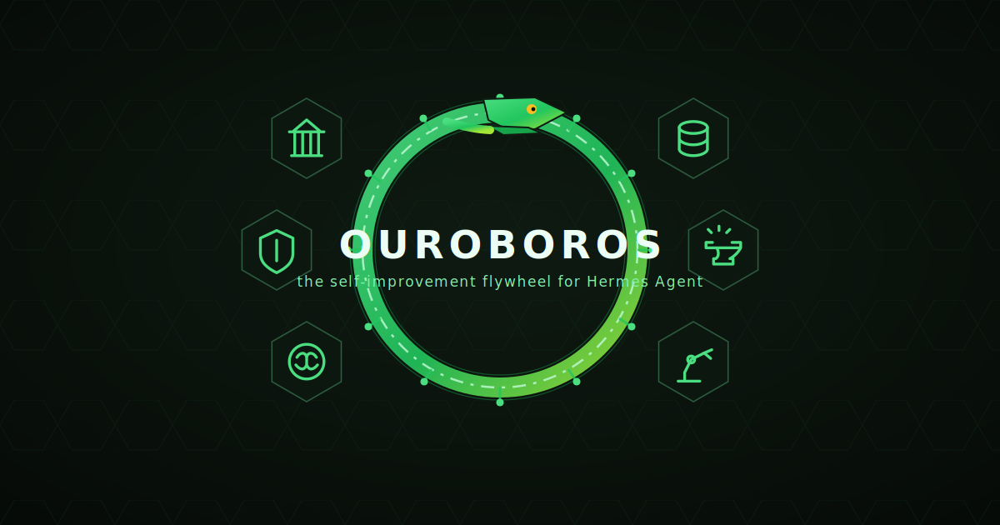

<p align="center">
  
</p>

<h1 align="center">🐍 Ouroboros</h1>

<p align="center">
  <b>The self-improvement flywheel for <a href="https://github.com/NousResearch/hermes-agent">Hermes Agent</a>.</b><br>
  Your agent produces exhaust every session — tool calls, compressions, repeated requests, hard decisions, finished tasks.<br>
  Stock agents let it dissipate. <b>Ouroboros eats it.</b>
</p>

<p align="center">
  <a href="#-install">Install</a> •
  <a href="#-the-flywheel">The Flywheel</a> •
  <a href="#-the-six">The Six</a> •
  <a href="#-60-second-demo">Demo</a> •
  <a href="docs/LAUNCH_THREAD.md">X Thread</a>
</p>

---

## 🔄 The Flywheel

Six plugins (+1 tiny keystone) that lock into one loop. Each stage feeds the next; the output of the loop is a better agent, which produces better input for the loop.

```
                 ┌──────────────────────────────────────────┐
                 │                                          │
                 ▼                                          │
        ┌─────────────────┐   ┌──────────┐   ┌──────────┐   │
        │  🧠 REMEMBER    │   │ 🛡 TRUST │   │ 🏛 DECIDE│   │
        │  echo + archive │──▶│ seatbelt │──▶│ council  │   │
        └─────────────────┘   └──────────┘   └──────────┘   │
                 ▲                                │         │
                 │                                ▼         │
        ┌─────────────────┐   ┌──────────┐   ┌──────────┐   │
        │  ⚒ LEARN        │◀─│ 🤖 AUTO- │◀─│ (you,    │   │
        │  forge          │   │  MATE    │   │  living  │───┘
        │                 │   │ autopilot│   │  life)   │
        └─────────────────┘   └──────────┘   └──────────┘
```

| Stage | Plugin | What it eats | What it excretes |
|---|---|---|---|
| 🧠 **REMEMBER** | `echo` | your past sessions (local FTS5) | relevant excerpts, auto-injected into every turn |
| 🗄 **PRESERVE** | `archive` | context windows the compressor would discard | a searchable deep archive the agent can re-open mid-chat |
| 🛡 **TRUST** | `seatbelt` | every tool call | policy: block/approve/rate-limit/budget + a 90-day audit trail |
| 🏛 **DECIDE** | `council` | your hard questions | 2–5 tool-using subagents argue; a judge keeps the dissent |
| 🤖 **AUTOMATE** | `autopilot` | your repeated requests | one-tap cron jobs — "you asked this 5×, want it at 08:30 daily?" |
| ⚒ **LEARN** | `forge` | your best real sessions | a ShareGPT fine-tuning dataset of *your* workflows |
| 🐍 *(keystone)* | `ouroboros` | the other six's state | `/ouroboros` — the whole flywheel, one glance |

Better memory → better sessions → better data → a better agent → better memory. **Run it long enough and the loop is the point.**

## ⚡ Install

```bash
git clone https://github.com/JamesFincher/hermes-ouroboros.git
cd hermes-ouroboros
./install.sh   # copies plugins into ~/.hermes/plugins + prints the enable lines
```

Then:

```bash
hermes plugins enable seatbelt echo council autopilot forge ouroboros
hermes plugins enable archive
# archive is a context engine — also set in ~/.hermes/config.yaml:
#   context:
#     engine: archive
```

Requires a working [Hermes Agent](https://github.com/NousResearch/hermes-agent) install (v0.11+; v0.14+ recommended for plugin LLM access). No new API keys: everything runs on your existing model, your local SQLite, your machine.

## 🐍 The Six

### `echo` — the agent remembers what you did last Tuesday
Hermes ships session *search* (a tool the model must remember to call). Echo is the opposite: every turn, before the model sees your message, it FTS5-searches your own past sessions and injects the 2–3 most relevant excerpts — with recency ranking, cron demotion, déjà-vu detection, and anti-spam guards. Zero config, zero external service, zero embeddings.

> *You:* "why did the gateway die last week?" — *the answer from last week's Telegram session is already in front of the model.*

### `archive` — compression without amnesia
The first real alternative **context engine** for Hermes. It wraps the stock compressor (identical triggers, identical summaries) but seals every discarded window into an FTS5 archive *before* summarizing, flushes the tail at session end, and gives the agent `archive_search` / `archive_expand` tools to rehydrate anything mid-conversation. The `ContextEngine` ABC was built for this; nobody shipped it. Now someone did.

> *Three compressions into a marathon session:* "what was that error again?" — the agent pulls the verbatim window back, in-band.

### `seatbelt` — run `/yolo` with a safety net
A declarative policy engine over **every** tool call, not just shell strings: YAML rules with `block` / `approve` / `audit` actions, per-tool rate limits, per-session call budgets (the runaway-loop circuit breaker), human-approval escalation with allowlist grains, and a tamper-evident SQLite audit log. Ships with sane defaults: `~/.ssh` writes blocked, `.env` reads need a human, 500-call session budget.

> *The agent loops on a flaky tool at 2 AM — the budget guard trips and asks you instead of burning the provider bill.*

### `council` — don't ask one agent what five would argue about
Fans your hard question to 2–5 full subagents (real tools, isolated contexts) briefed with adversarial lenses — Analyst, Skeptic, Pragmatist, Contrarian, User-Advocate — then a structured judge scores each position, synthesizes the strongest answer, and **preserves the unresolved dissent**. Modes: `deliberate`, `redteam` (one architect, the rest attack), `race` (competing solutions, ranked).

> `/council redteam` — your "finished" migration plan gets attacked by four tool-armed skeptics before production does it for them.

### `autopilot` — "you asked this 5 times, want it automated?"
Mines your interactive history for recurring intents (background thread, every ~5 sessions), drafts self-contained cron jobs with a structured LLM pass, and queues them for one-tap approval. Approving writes a **real Hermes cron job** — the scheduler, `/cron`, and delivery just work. Dismissed patterns never resurface; nothing is ever created without your explicit yes.

> */autopilot list* → "Morning GitHub triage briefing — seen 9×, proposed `every day 08:30`" → `approve` → done forever.

### `forge` — your usage is the dataset
Hermes can *generate* synthetic trajectories; Forge harvests the far better corpus you produce for free: real tasks, real tool chains, real recoveries. It selects completed sessions with real tool use, filters frustration/failure with heuristics, rubric-scores survivors via `ctx.llm`, converts keepers to Hermes' exact ShareGPT trajectory format, dedupes, and appends to `~/.hermes/forge/dataset.jsonl`.

> *Monthly `/forge harvest 30` — a personal SFT corpus of your own corrected workflows, growing while you sleep.*

### `ouroboros` — the keystone
`/ouroboros` renders the flywheel: live status of all six stages (sealed tokens, audited calls, pending automations, dataset size) and the single most valuable next action to keep the loop spinning. `/ouroboros story` tells the legend.

## 🎬 60-second demo

```text
you:  /ouroboros                     # watch the flywheel spin up
you:  why did the redis deploy fail last week?
      # echo has already injected last week's session — the model just answers
you:  /council Should we move state.db to Postgres, or shard SQLite?
      # 3 subagents argue it with tools; judge returns synthesis + dissent
you:  /autopilot list                # "weekly dependency-audit summary — seen 4×"
you:  /autopilot approve a1b2        # it's a cron job now
you:  /forge harvest 30              # last month → dataset.jsonl
you:  /seatbelt tail                 # everything the agent did, accountable
```

## 🧬 Why this is different

| | Bundled world | Ouroboros |
|---|---|---|
| Recall | `session_search` — the model must remember to search | **echo** — it can't *not* remember |
| Compression | summarize-and-discard | **archive** — seal-then-summarize, agent-searchable |
| Safety | pattern warnings on written code | **seatbelt** — policy + budgets + audit over all tools |
| Delegation | divide work; MoA advises one turn | **council** — tool-armed adversaries + judged dissent |
| Scheduling | you notice repetition, you write cron | **autopilot** — it notices, drafts, you approve |
| Training data | synthetic batch generation | **forge** — your real sessions, distilled |

Every plugin is **fail-soft** (a plugin error degrades to silence, never a broken turn), **local-first** (SQLite + your existing model; no new services or keys), and **independent** (enable any subset — but they compound).

## 🗺 Roadmap

- [ ] `echo` ↔ `archive` shared ranking (archive chunks as recall sources)
- [ ] `forge` quality weights from `seatbelt` audit outcomes
- [ ] `council` persistent verdict history + dashboard tab
- [ ] `autopilot` skill-authoring approvals (currently cron + memory)
- [ ] one-command `hermes plugins install` once the pack lands in the registry

## 🤝 Contributing

Issues and PRs welcome. Each plugin is small on purpose (~150–350 LOC) and the interesting bugs are *behavioral*: recall ranking, rubric thresholds, council lenses. If you run Ouroboros for a week, the most valuable contribution is your flywheel story — open a Discussion.

## 📜 License

Apache-2.0 — same as Hermes Agent. See [LICENSE](LICENSE).

---

<p align="center">
  <i>The snake that eats its tail. The agent that eats its history.</i><br>
  <b>If the loop spins for you, ⭐ the repo — it feeds the snake.</b>
</p>
